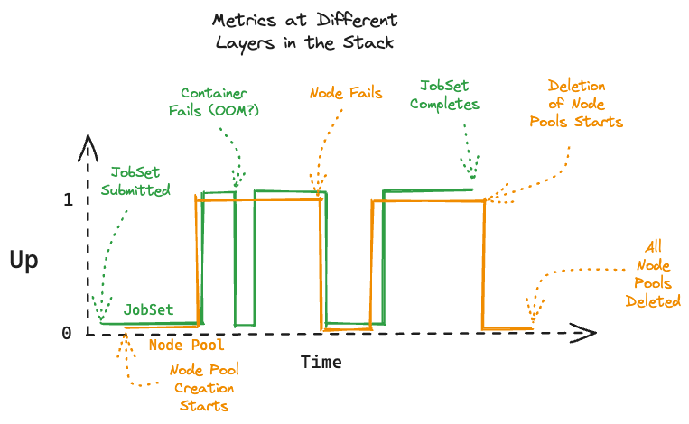
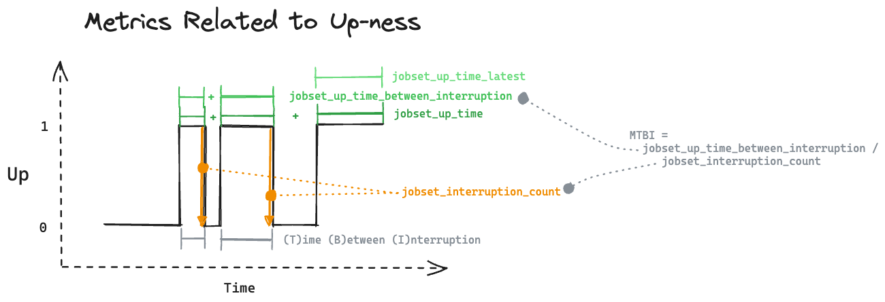

# MegaMon

MegaMon provides metrics related to running JobSets on top of Kubernetes.

MegaMon provides metrics at the container and node levels.

MegaMon provides granular metrics about when a JobSet is Up. This allows for calculations such as MTBI (Mean Time Between Interruption).

MegaMon provides granular merics about when a JobSet is Down. This allows for calculations such as MTTR (Mean Time To Recovery).

## TODO

* Make sure to always emit the final summaries for a completed/failed jobset.
* Account for jobset UIDs.

## Why MegaMon over Kube State Metrics

MegaMon was created to address shortcoming of using [kube-state-metrics](https://github.com/kubernetes/kube-state-metrics):

* Lack of ability to stop publishing a metric the moment a JobSet completes/fails.
* Difficult/impossible to aggregate metrics across all JobSets if time-line of metrics is not well defined.
* Complexity in querying Node metrics (Node labels are a separate metric)
* Difficult to derive high level metrics (like MTTR) when baseline metrics like Up-ness of jobset containers / nodes require their own complex queries.
* Difficult or impossible to derive metrics like Time-to-provisioning / Time-to-first-up with promql
* Current metrics are very large (they require all Nodes to be published as individual metrics and aggregated later)
